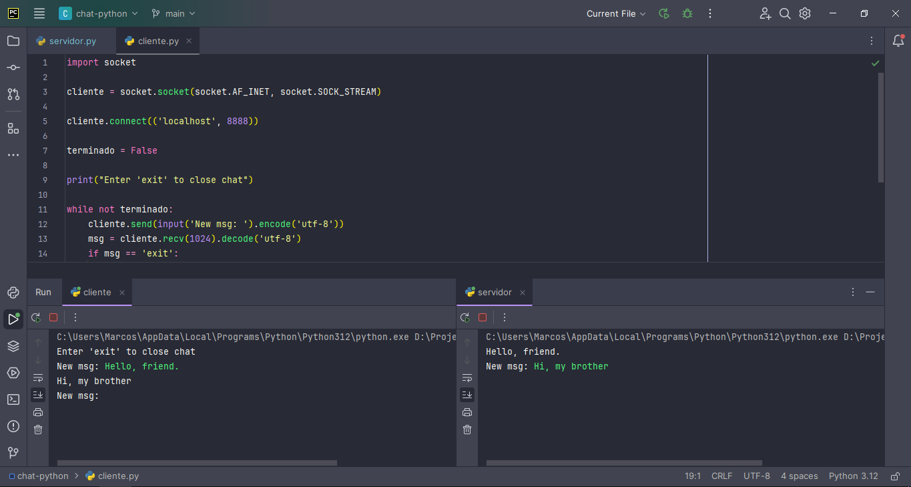

### Cliente/Servidor Python Chat



## Instalação
**Linux**
````bash
python3 -m pip install requeriments.txt
````
**Windows**
````commandline
py -m pip install requeriments.txt
````

## Execução

Inicie o arquivos ```servidor.py``` e em outro terminal execute o arquivo ```cliente.py```
